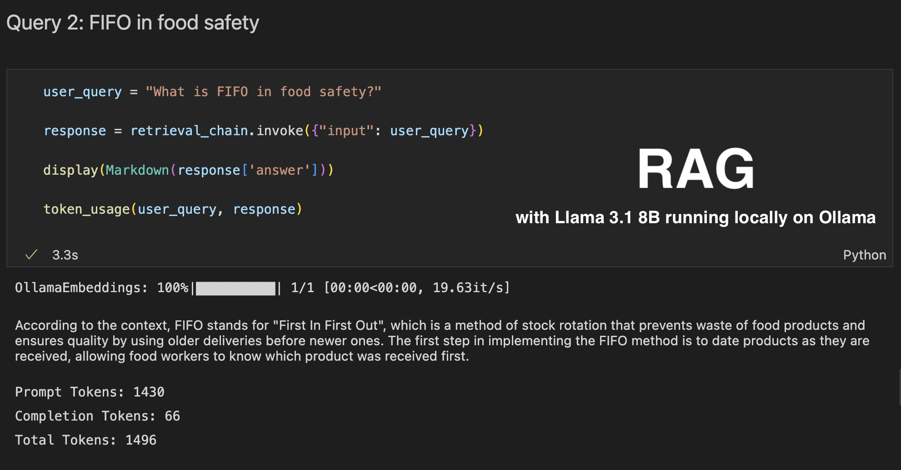
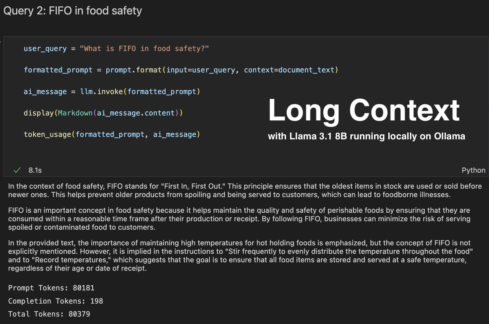

# RAG or Long Context: which wins?

## Introduction
LLMs are evolving rapidly, with two key advancements deserving attention: RAG and Long Context. Both approaches enable LLMs to access and process external information needed to answer a query but with differences.

𝐑𝐀𝐆 operates by retrieving from external knowledge sources the information where the answer to the query is, and then feeding this information to the LLM for response generation. This approach excels at handling factual queries, providing up-to-date responses, and mitigating hallucinations. However, it relies on the quality of the retrieved information and can be computationally expensive.

𝐋𝐨𝐧𝐠 𝐂𝐨𝐧𝐭𝐞𝐱𝐭 enables a contrasting approach. They allow LLMs to process and generate text based on significantly longer input sequences. This allows to feed the LLM with larger amounts of information along the prompt, potentially reducing the need for external knowledge sources like RAG. In a [recent LinkedIn post](https://www.linkedin.com/posts/armelayimdji_llms-openmodel-accessibility-activity-7222204673594716161-4eB3?utm_source=share&utm_medium=member_desktop), I expressed my excitement about the 128k context window of Llama 3.1. However, the ability to utilize such a long context presents a tempting shortcut: feeding the LLM entire documents containing answers to queries. While this approach seems attractive, it has drawbacks like higher costs (due to increased token usage), computational challenges, and potential impacts on model performance.

## Repository description

- The `docs` directory contains `fpc-manual.pdf`, a pdf document of 94 pages on food protection ([Official link](https://www.nyc.gov/assets/doh/downloads/pdf/rii/fpc-manual.pdf)).
- The notebook `LocalBot-RAG.ipynb` contains code snippets to query the pdf document using RAG.
- The notebook `LocalBot-LongContext.ipynb` contains code snippets to query the pdf document using long context.
- The notebooks use chat models with a local instance of LLama 3.1 running on ollama. You'll need to install ollama and pull Llama 3.1 or another model. However, you are free to use a closed model like OpenAI GPT-X.

## Installation

1. Clone the repository.

2. Get Ollama up and running.
   * Download and install [Ollama](https://ollama.com/download) for your operating system.
   * Verify Ollama is working by executing `ollama` command in a terminal. It will display ollama command's help. If the command is not found, you might need to reinstall.
   * Use Ollama to download an open LLM. The exact command will depend on the model and the specific version you want. The full list is available [here](https://ollama.com/library). For example, you can pull Llama3.1 8b (4.7 GB) by running `ollama pull llama3.1:8b`.
   * Run `ollama list` command to list the models available on your local system and verify llama3.1:8b is in the list.
   * You can start prompting llama3 from your terminal with `ollama run llama3.1:8b`

3. If [Python](https://www.python.org/) is not installed yet, download and install it.

4. Create and activate a python virtual environment (e.g., `localbot_env`) as described [here](https://packaging.python.org/en/latest/guides/installing-using-pip-and-virtual-environments/#create-and-use-virtual-environments).

    Once activated, the name of your python environment should appear in the terminal as follows:
    ```bash
    (localbot_env) %
    ```

5. Install the required libraries in the python environment created: `langchain, langchain_community, langchain_openai, pymupdf, chromadb, tiktoken`  .

    ```bash
    (localbot_env) % pip install langchain langchain_community langchain_openai pymupdf chromadb tiktoken
    ```
6. Run the cells of your notebooks




